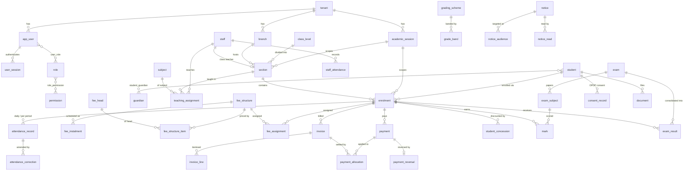

# EduNova — Architecture & Data Model

_Phase 0 deliverable. Companion to [PRODUCTION-PLAN.md](PRODUCTION-PLAN.md)._

---

## 1. Decisions

| Decision | Choice | Consequence |
|---|---|---|
| Path | Build the real product | ~4.5–6 months to safe MVP |
| Database | **Supabase** (managed Postgres + Storage + backups) | Plain SQL migrations, portable schema |
| Auth | **Custom (Lucia-style)** — own users/sessions/password tables, Argon2id | Full control; we build reset, lockout and MFA ourselves |
| Business logic | **Fastify + TypeScript API server**, sole database writer | Fees and marks logic is server-side and testable |
| Tenancy | Single tenant now, `tenant_id` on every table from day one | Multi-tenant later is onboarding, not migration |
| MVP roles | superadmin, admin, accountant, teacher, student | Guardian seeded in schema, portal deferred |
| MVP modules | Attendance, Fees, Exams/Marks, Notices | Over students + staff records |
| Compliance | India DPDP Act 2023 | Consent and data-request tables ship with v1 |

Because we chose custom auth, **Supabase Auth is not used**. Supabase is serving
as managed Postgres, object storage and backups. That keeps the schema portable
— if you ever move to plain RDS or Neon, these migrations run unchanged.

---

## 2. System shape

```
┌────────────────┐   httpOnly cookie    ┌──────────────────────┐
│  Vue 3 SPA     │ ───────────────────► │  Fastify API         │
│  (this repo)   │ ◄─────────────────── │  · Lucia sessions    │
└────────────────┘      JSON            │  · Zod validation    │
                                        │  · RBAC + row scope  │
                                        │  · business logic    │
                                        └──────────┬───────────┘
                                                   │ erp_app role
                                                   │ SET LOCAL app.tenant_id
                                                   ▼
                                        ┌──────────────────────┐
                                        │  Supabase Postgres   │
                                        │  · RLS tenant guard  │
                                        │  · audit triggers    │
                                        │  · money invariants  │
                                        └──────────────────────┘
                                        ┌──────────────────────┐
                                        │  Supabase Storage    │
                                        │  private buckets,    │
                                        │  signed URLs only    │
                                        └──────────────────────┘
```

The browser never talks to Supabase. There is no anon key in the frontend.

---

## 3. Defence in depth

Four independent layers, so no single mistake exposes student data:

1. **API authorisation** — permission check + row-level scope on every route.
   Produces meaningful 403s.
2. **RLS tenant isolation** ([0010](../supabase/migrations/0010_rls_tenant_isolation.sql)) —
   the API connects as `erp_app`, which is not the table owner and has
   `NOBYPASSRLS`. A query that forgets its tenant filter returns zero rows
   instead of another school's children.
3. **Database invariants** — payments immutable, audit log append-only, marks
   bounded by their exam maximum, one enrolment per student per session.
   These hold even against a rogue `psql` session.
4. **Audit trail** ([0009](../supabase/migrations/0009_audit_and_compliance.sql)) —
   before/after JSON on every write to students, enrolments, staff, invoices,
   payments, concessions, marks, exams, users and role grants.

### Authentication design

- Argon2id hashing in the API; the database never sees plaintext.
- Session token is random, stored **SHA-256 hashed** in `user_session` — a
  database leak yields no usable sessions.
- Cookie: `httpOnly; Secure; SameSite=Lax`, sliding expiry.
- Login rate-limited at the edge; `failed_login_count` + `locked_until` in the
  row as backstop.
- Single-use, hashed, expiring password-reset tokens.
- `must_change_password` defaults **true** — no account ships with a known password.
- MFA mandatory for admin/superadmin, enforced in the API (the requirement is
  role-derived, and roles are multi-valued).

### Row-level scope within a tenant

Permissions say *what*, these say *whose*:

| Role | Sees |
|---|---|
| teacher | Sections in `teaching_assignment` + sections where they are `class_teacher_id` |
| student | Their own enrolment only |
| guardian | Enrolments of children in `student_guardian` |
| accountant | All fee data, no marks |
| admin | Everything in the tenant |

This stays in the API rather than RLS, deliberately — a 403 that explains
itself beats a silently empty list when a teacher opens the wrong class.

---

## 4. Data model

The pivot of the whole design: **`student` is the person, `enrolment` is their
placement in one academic session.** Attendance, fees, marks and results all
reference the *enrolment*, never the student. That is what makes year-on-year
history correct, promotion an insert rather than a mutation, and "what were
this child's Grade 8 marks" a query rather than an archaeology project.



### Invariants the database enforces

These are not conventions or code comments — they are constraints, and the
[smoke test](../supabase/tests/schema_smoke.sql) proves each one:

| # | Invariant | Mechanism |
|---|---|---|
| 1 | One enrolment per student per session | `unique (student_id, session_id)` |
| 2 | Exactly one current academic session | partial unique index |
| 3 | One attendance record per enrolment/date/period | two partial unique indexes (NULL period = daily) |
| 4 | **Receipt numbers are gapless** | `next_document_number()` locks a counter row; a rollback returns the number. A Postgres sequence would leave audit holes. |
| 5 | **Payments are immutable** | trigger blocks UPDATE/DELETE; only `completed → reversed` passes |
| 6 | Invoice balance can never drift | `invoice_balance` **view**, derived from allocations — not a stored column |
| 7 | Money is exact | `numeric(12,2)` everywhere, never float |
| 8 | Marks cannot exceed the paper maximum | `validate_mark()` trigger against `exam_subject` |
| 9 | An absent student carries no component marks | same trigger |
| 10 | A locked exam rejects mark changes | same trigger |
| 11 | Audit log is append-only | trigger blocks UPDATE/DELETE |
| 12 | One primary contact per student | partial unique index |
| 13 | Cross-tenant read and write are impossible | RLS, verified as `erp_app` |

### DPDP compliance, built in

The Act treats children's data as a special category: processing needs
verifiable parental consent, and behavioural tracking or targeted advertising
directed at children is prohibited outright. The school is the Data Fiduciary,
you are the Data Processor.

- `consent_record` — per-purpose, per-guardian, versioned against the privacy
  notice they actually saw, with withdrawal timestamps.
- `data_subject_request` — access, correction, erasure and grievance requests
  with due dates, so the school can evidence compliance.
- `tenant.data_retention_years` — drives the purge job.
- `student.medical_notes` and `document.is_sensitive` are flagged for
  permission-gated, audit-logged reads.
- Documents live in **private** buckets, served only via short-lived signed
  URLs issued after an authorisation check.

---

## 5. Verifying the schema

```bash
./scripts/db-test.sh
```

Recreates a throwaway database, applies all 11 migrations, and runs 13 groups
of assertions covering RBAC seeding, enrolment uniqueness, attendance rules,
gapless receipts, invoice arithmetic, payment immutability and reversal, mark
validation, notice targeting, audit capture and tenant isolation.

Needs a local Postgres (`brew services start postgresql@14`). Verified against
PostgreSQL 14; Supabase currently runs 15/17, and nothing here depends on
version-specific behaviour.

---

## 6. Phase 1 build order

1. ✅ **API skeleton** — Fastify, Zod, the request-context middleware that
   issues `SET LOCAL app.tenant_id` / `app.user_id` per transaction.
2. ✅ **Auth** — login, session, logout, reset, forced password change,
   lockout, TOTP MFA. Email delivery still to wire.
3. ✅ **RBAC middleware** — permission check plus the row-scope resolvers in §3.
4. ⬜ **Tenant + school setup** — sessions, branches, classes, sections, subjects.
5. 🟡 **Students** CRUD done (API + UI); **staff** CRUD and CSV import with
   dry-run preview still to build.
6. ⬜ Then the four MVP modules, in order: **Attendance → Notices →
   Exams/Marks → Fees.** Fees last: it is the one with the most rules, and by
   then the audit, permission and testing patterns are settled.

See [api/README.md](../api/README.md) for what exists and how to run it.

**Query layer:** plain SQL through `postgres.js`, not an ORM. These migrations
are the source of truth, and the fee and mark logic leans on generated
columns, partial indexes and triggers that an ORM schema would either hide or
fight. The earlier Drizzle recommendation was dropped for that reason — it
would have meant either regenerating the schema from TypeScript (losing the
invariants) or maintaining a hand-written mirror that silently drifts.

---

## 7. Verifying the API

```bash
cd api && npm install && npm test
```

65 tests across seven files, each run against a database rebuilt from these
migrations — so a broken migration fails the suite at setup rather than in
production.

| File | Covers |
|---|---|
| `totp.test.ts` | RFC 6238 test vectors, base32, clock drift, malformed input |
| `auth.test.ts` | Login, token hashing, enumeration resistance, lockout, mid-session disable, forced password change, reset and replay, MFA and recovery codes |
| `rbac.test.ts` | Permission catalogue matches the database; teacher/student/accountant negative cases; scoped pagination counts |
| `students.test.ts` | Phase 1 exit criterion, audit before/after, conflicts, sensitive-field gating, withdrawal not deletion |
| `tenant-isolation.test.ts` | RLS through the real app path, unfiltered-query safety, pooled-connection context leakage, `erp_app` has no BYPASSRLS |
| `rate-limit.test.ts` | Per-IP login throttling |
| `dashboard.test.ts` | Scoped summary figures, permission-gated fields, audit actor labels |

---

## 8. Frontend (Phase 2)

The browser talks only to the API — no Supabase key ships to the client.

- **Routing**: real URLs, lazy-loaded routes, guards that resolve the session
  from the server. Pages are bookmarkable and survive a refresh.
- **Data**: TanStack Query over a single fetch client with `credentials:
  'include'`. Loading skeletons and error states everywhere, including a
  distinct offline case. A 401 anywhere clears the session and redirects once.
- **Permissions**: `/auth/me` returns the user's permission list; the client
  uses it only to hide UI. Every check is re-run server-side.
- **No fabricated data.** Modules without a backend render a roadmap panel
  stating plainly that they are not connected, rather than sample records a
  school could mistake for real ones.
